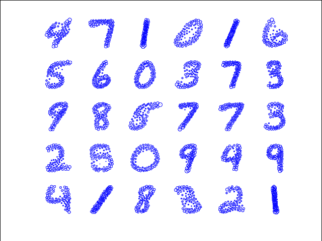

Accelerated and Parallel Clustering of Discrete Distributions
=============

AD2-clustering is a parallel clustering algorithm for **D**iscrete **D**istributions,
including normalized histogram and correlated n-gram as special cases,
under the *exact* [Wasserstein metric](http://en.wikipedia.org/wiki/Wasserstein_metric).
It follows the Elkan's algorithm [1] of k-means to save unnecessary
computation of instance re-labeling, and uses a modifed version of
Bregman ADMM [2] to accelerate and scale-up the computation of cluster centroids.
Please see [3] for technical details. 



Example: the 30 clusters of MNIST digits (each "centroid" discrete distribution is visualized).

## Discrete Distributions
There are three data types of discrete distribution that have been covered
in this project:
 - [default] discrete distribution over vector space endowed with Euclidean distance
 - Same type as the default one, but over embeddings space with a finite vocabulary size
   (e.g. document represented by tf-idf over word vectors, sparsified histograms)
 - normalized (dense) histograms with bin-to-bin distance
 - [**experimental] d2 over [n-gram](http://en.wikipedia.org/wiki/N-gram) provided
   with item-to-item similarity/distance (sparse histograms are represented as 1-gram)

An object/instance can be represented as the joint of multiple discrete
distributions (of any aforementioned type), called phases. For example, an image can be
represented in two phases: color distribution and texture distribution; a protein
sequence can be represented as distributions in three phases, aka,
1-gram, 2-gram, 3-gram of amino acid.
The co-clustering is then performed jointly over multiple phases.

## How to compile and run tests
Though one can build a serial version to solve small-to-moderate scale problems with speed,
the strength of AD-clustering is its scalability to large dataset with parallelization of 
high-efficiency (over 80% on hundreds of cores). 

Build dependencies:
 - MPI
 - CBLAS
 - [Mosek](https://mosek.com) 7.0+: free individual academic license available.
 
```
 $ make MPI=0 # build sequential version, or
 $ make MPI=1 # build MPI version (default)
```

Run unit tests (it takes several minutes):
```
 $ make test 
```

## Guides and Tutorials
 - [data format supported](data)
 - [clustering "20newsgroups" as bags of word-vectors](https://github.com/bobye/20newsgroups/wiki)

## Reference
1. Elkan, Charles. "Using the triangle inequality to accelerate k-means." ICML. Vol. 3. 2003.
2. Wang, Huahua et al. "Bregman Alternating Direction Method of Multipliers." NIPS. 2014.
3. Ye, Jianbo et al. "Fast Discrete Distribution Clustering under Wasserstein Distance" in submission to NIPS 2015.


